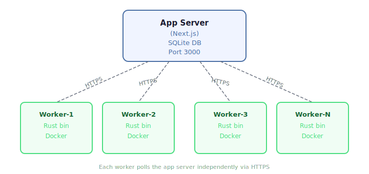

# Judge Workers

JudgeKit supports N concurrent judge workers connecting to a single app server. Workers can run on the same machine or be distributed across dedicated hosts.

## Architecture

Workers access the app via HTTP(S) only. The PostgreSQL runtime handles concurrent access. The atomic `UPDATE...RETURNING` claim SQL prevents race conditions — only one worker can claim a given submission.

<p align="center">
  
</p>

## Worker Lifecycle

### Registration

On startup, the worker POSTs to `/api/v1/judge/register` with its hostname and concurrency. The server returns a `workerId` and heartbeat interval.

If registration fails, the worker exits by default. Set `JUDGE_ALLOW_UNREGISTERED_MODE=1` only when you explicitly want degraded standalone operation.

### Heartbeat

A background task POSTs to `/api/v1/judge/heartbeat` every 30 seconds with:
- `workerId` — identifies the worker
- `activeTasks` — current in-flight submission count
- `availableSlots` — remaining concurrency capacity
- `uptimeSeconds` — worker uptime

The heartbeat endpoint piggybacks a staleness sweep: workers whose last heartbeat exceeds `3 * heartbeatInterval` are marked `stale`.

### Claiming

Workers poll `/api/v1/judge/claim` to claim submissions. The claim request includes the optional `workerId`, which is recorded on the submission for tracking and audit.

### Graceful Shutdown (SIGTERM)

1. Stops claiming new submissions
2. Awaits all in-flight tasks to complete
3. Cancels the heartbeat task
4. POSTs to `/api/v1/judge/deregister`
5. Exits

### Fault Tolerance

| Scenario | Mitigation |
|----------|-----------|
| Two workers claim same submission | Atomic `UPDATE...RETURNING` — only one gets the row |
| Worker crashes mid-judging | Stale claim timeout (configurable, default 5 min) — reclaimed by next worker |
| Worker reports result after reclaim | Claim token mismatch — 403 rejected |
| Heartbeat failure | After 3 consecutive failures, logs warning; worker keeps running |

## Configuration

### Worker Environment Variables

| Variable | Default | Description |
|----------|---------|-------------|
| `JUDGE_BASE_URL` | `http://localhost:3000/api/v1` | App server API URL |
| `JUDGE_AUTH_TOKEN` | (required) | Bearer token for judge API auth |
| `JUDGE_CONCURRENCY` | `1` | Max concurrent submissions (1-16) |
| `JUDGE_WORKER_HOSTNAME` | System hostname | Hostname reported to app server |
| `POLL_INTERVAL` | `2000` | Polling interval in ms |
| `DEAD_LETTER_DIR` | `./dead-letter` | Directory for failed result payloads |

## Deployment

### Single-machine (co-located)

The judge worker is part of `docker-compose.production.yml` by default. No profile flag is needed:

```bash
docker compose -f docker-compose.production.yml --env-file .env.production up -d
```

> The worker used to be gated behind `profiles: ["worker"]`, but forgetting `--profile worker` during a manual recovery caused a silent worker outage in Apr 2026. The profile has been removed so the worker always starts with the rest of the stack.

### Dedicated workers

Use `docker-compose.worker.yml` on separate machines:

```bash
JUDGE_BASE_URL=https://oj.example.com/api/v1 \
JUDGE_AUTH_TOKEN=your-token \
JUDGE_CONCURRENCY=4 \
docker compose -f docker-compose.worker.yml up -d
```

The dedicated worker compose file includes a local `docker-proxy` sidecar. The judge worker reaches Docker through `DOCKER_HOST=tcp://docker-proxy:2375` instead of mounting `/var/run/docker.sock` directly, which narrows direct daemon exposure. The worker container itself no longer needs `SYS_ADMIN` or AppArmor overrides to do that.

By default, the dedicated worker compose file now enables only container lifecycle access on the proxy. If you intentionally want the remote worker to expose image/build management through the runner, opt in with:

```bash
WORKER_DOCKER_PROXY_IMAGES=1 \
WORKER_DOCKER_PROXY_BUILD=1 \
WORKER_DOCKER_PROXY_POST=1 \
WORKER_DOCKER_PROXY_DELETE=1
```

It also publishes the Rust runner on host loopback:

```text
127.0.0.1:${RUNNER_PORT:-3001}:3001
```

That loopback port is useful for split app/worker topologies such as
the app host reaching the worker runner through an SSH tunnel / host bridge
path instead of running a co-located judge worker.

Outside containerized deployments, the Rust runner now defaults to `127.0.0.1` unless `RUNNER_HOST` is set explicitly. The Docker compose files still set `RUNNER_HOST=0.0.0.0` where container port publishing is required.

> **Important:** this horizontal scaling guidance applies to **judge workers**.
> The main Next.js app now supports two realtime modes for the routes that need
> shared coordination:
> - process-local single-instance mode (`APP_INSTANCE_COUNT=1` or
>   `REALTIME_SINGLE_INSTANCE_ACK=1`)
> - PostgreSQL-backed shared coordination mode
>   (`REALTIME_COORDINATION_BACKEND=postgresql`) for SSE connection-cap
>   enforcement and anti-cheat heartbeat deduplication
>
> `redis` remains unsupported. App-server replication still requires validated
> sticky-session/load-balancer behavior before it is safe to rely on
> multi-instance operation for serious contest or exam use.

### Deploy script

Automates image transfer and setup for remote machines:

```bash
./scripts/deploy-worker.sh \
  --host=192.168.1.10 \
  --app-url=https://oj.example.com/api/v1 \
  --concurrency=4 \
  --sync-images
```

Options:
- `--host=<ip>` — Target machine (required)
- `--app-url=<url>` — App server API URL (required)
- `--token=<token>` — Judge auth token (reads from `.env.production` if omitted)
- `--concurrency=<n>` — Max concurrent submissions (default: 4)

The deploy script now copies the worker `.env` file with mode `0600` instead of embedding the shared judge token directly into a remote shell heredoc.
- `--sync-images` — Also transfer judge language Docker images
- `--ssh-user=<user>` — SSH user (default: root)

### Docker Image Distribution

For 2-3 workers, `deploy-worker.sh --sync-images` transfers images via `docker save | ssh | docker load`.

For larger fleets, use `deploy-worker.sh --sync-images` or your own registry/distribution tooling. `JUDGE_DOCKER_REGISTRY` is not a current built-in startup-pull feature.

## Admin Dashboard

The workers admin page at `/dashboard/admin/workers` (requires `system.settings` capability) shows:

- **Stats cards** — Workers online, queue depth, active judging, total concurrency
- **Workers table** — Alias, hostname, IP address, status, concurrency, active tasks, version, last heartbeat
- **Alias editing** — Click the pencil icon to set a friendly name for each worker
- **Force-remove** — Remove a worker and reclaim its in-flight submissions

Data auto-refreshes every 10 seconds.

## API Endpoints

| Endpoint | Method | Auth | Purpose |
|----------|--------|------|---------|
| `/api/v1/judge/register` | POST | Bearer | Worker registration |
| `/api/v1/judge/heartbeat` | POST | Bearer | Periodic health ping |
| `/api/v1/judge/deregister` | POST | Bearer | Graceful shutdown |
| `/api/v1/judge/claim` | POST | Bearer | Claim a submission (accepts optional `workerId`) |
| `/api/v1/judge/poll` | POST | Bearer | Report status/result |
| `/api/v1/admin/workers` | GET | Session | List all workers |
| `/api/v1/admin/workers/stats` | GET | Session | Aggregate stats |
| `/api/v1/admin/workers/:id` | DELETE | Session | Force-remove worker |
